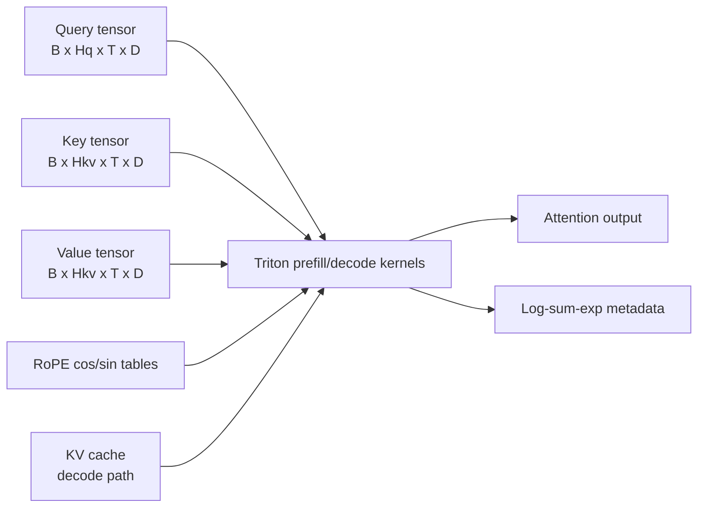
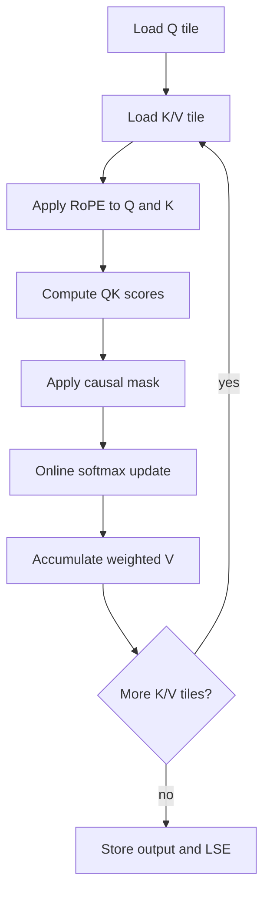
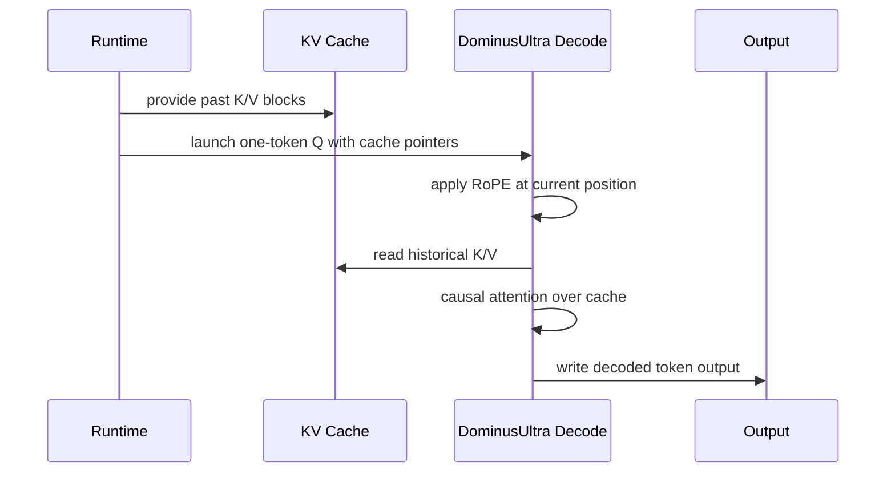
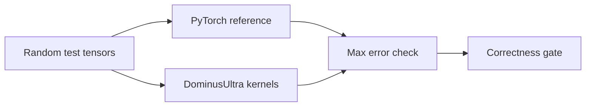

# DominusUltra Architecture

DominusUltra is built around one idea: keep the attention path close to the GPU, avoid unnecessary intermediate tensors, and make every claim testable against a PyTorch reference.

The implementation is intentionally compact. The main kernel code lives in `dominus_ultra.py` so readers can follow the full path from Python wrapper to Triton launch to numerical validation without jumping across a large framework.

## System View

## Prefill Path

The prefill path handles multi-token causal attention. It tiles the query and key/value sequence dimensions, applies RoPE inside the kernel, and performs an online softmax so large attention matrices do not need to be materialized.

Design goals:

- Fuse RoPE into the attention path instead of requiring a separate rotated-Q/K allocation.
- Support GQA/MQA by mapping many query heads onto fewer key/value heads.
- Keep the algorithm readable enough for kernel-learning and portfolio review.
- Return log-sum-exp metadata for numerically stable attention workflows.

## Decode Path

The decode path is shaped for autoregressive generation, where the model appends one token at a time and attends over the existing KV cache.

This separation matters because prefill and decode stress different parts of the system. Prefill is bulk throughput. Decode is cache access, launch overhead, and per-token latency.

## Correctness Contract

The test suite treats PyTorch as the reference implementation:

1. Generate Q/K/V tensors for multiple shapes and head layouts.
2. Apply the same RoPE math in a readable reference path.
3. Use PyTorch scaled dot-product attention as the baseline.
4. Compare Triton output against the reference with dtype-aware tolerances.

## Benchmarking Model

`benchmark.py` compares DominusUltra against a PyTorch reference path using warmup iterations, CUDA synchronization, repeated timing, and matched tensor shapes.

Report benchmark results with:

- GPU model
- CUDA driver/runtime
- PyTorch version
- Triton version
- dtype
- benchmark command
- raw output

That context makes performance claims credible and reproducible.

## Extension Points

Good next experiments:

- Add a GPU-specific benchmark table to the README.
- Tune block sizes per architecture family.
- Compare against FlashAttention variants where available.
- Add FP8/INT8 experiments behind explicit feature branches.
- Expand the WebGPU RoPE demo into an interactive explainer.

## Reviewer Takeaway

DominusUltra is a small but complete systems-AI artifact: custom GPU kernels, reference validation, benchmarks, packaging, contributor hygiene, and documentation that explains the engineering tradeoffs. That combination is the signal.
