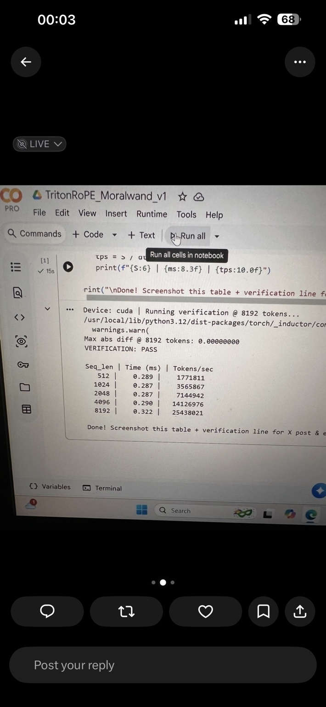

# Colab CUDA RoPE verification capture



## What the capture shows

The repository owner supplied this screenshot on July 21, 2026. The visible notebook output reports:

- device: `cuda`
- verification length: 8,192 token positions
- maximum absolute difference: `0.00000000`
- verification status: `PASS`

| Sequence length | Kernel time (ms) | Reported token-positions/s |
| ---: | ---: | ---: |
| 512 | 0.289 | 1,771,811 |
| 1,024 | 0.287 | 3,565,867 |
| 2,048 | 0.287 | 7,144,942 |
| 4,096 | 0.290 | 14,126,976 |
| 8,192 | 0.322 | 25,438,021 |

The throughput column is interpreted as isolated token-position throughput calculated from sequence length and elapsed kernel time. It is **not end-to-end language-model generation throughput**.

## Evidence status and limitations

This is an operator-supplied visual capture of one notebook run. It supports the narrow claim that the displayed 8,192-position run reported zero maximum absolute difference and a passing verification result.

It is not yet reviewer-complete benchmark evidence because the capture does not print the exact GPU model, CUDA/driver version, PyTorch version, Triton version, dtype, warmup count, measured iterations, source commit, or raw machine-readable output. The operator reported an NVIDIA T4, but that model is not independently visible in the screenshot.

Before promoting these numbers into the main benchmark table, rerun the in-repository report command and commit its generated Markdown and JSON:

```bash
python demo_speedtest.py --seq-len 8192 --dtype bfloat16 --iterations 40
```
